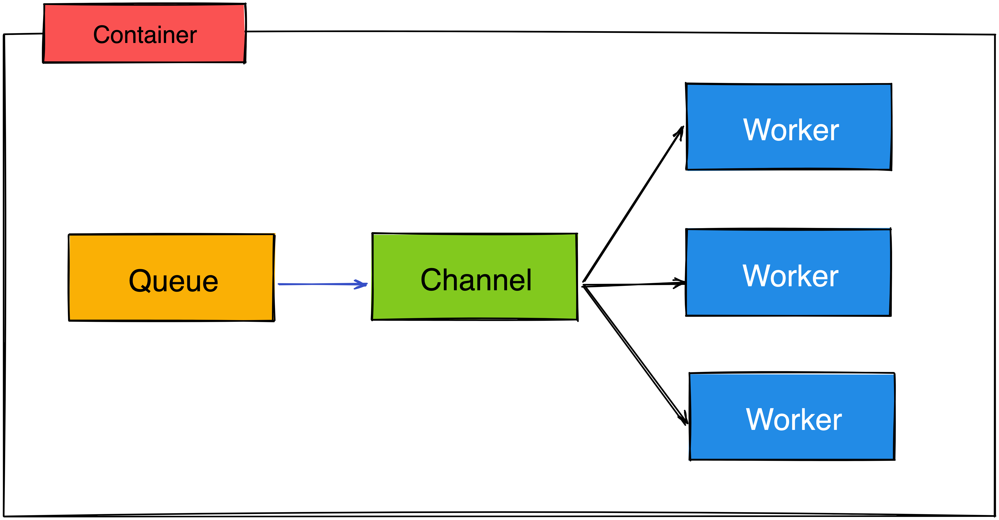

# Queue

[](https://github.com/golang-queue/queue/actions/workflows/codeql.yaml)
[](https://github.com/golang-queue/queue/actions/workflows/go.yml)
[](https://codecov.io/gh/golang-queue/queue)

Queue is a Golang library for spawning and managing a Goroutine pool, Allowing you to create multiple worker according to limit CPU number of machine.

## Features

* [x] Support [buffered channel](https://gobyexample.com/channel-buffering) queue.
* [x] Support [NSQ](https://nsq.io/) (A realtime distributed messaging platform) as backend.
* [x] Support [NATS](https://nats.io/) (Connective Technology for Adaptive Edge & Distributed Systems) as backend.
* [x] Support [Redis Pub/Sub](https://redis.io/docs/manual/pubsub/) as backend.
* [x] Support [Redis Streams](https://redis.io/docs/manual/data-types/streams/) as backend.

## Queue Scenario

In Single Container or VM



Multile Container with Queue service like NSQ, NATs or Redis


## Installation

Install the stable version:

```sh
go get github.com/golang-queue/queue
```

Install the latest verison:

```sh
go get github.com/golang-queue/queue@master
```

## Usage

### Basic usage of Pool (use Task function)

By calling `QueueTask()` method, it schedules the task executed by worker (goroutines) in the Pool.

```go
package main

import (
  "context"
  "fmt"
  "time"

  "github.com/golang-queue/queue"
)

func main() {
  taskN := 100
  rets := make(chan string, taskN)

  // initial queue pool
  q := queue.NewPool(5)
  // shutdown the service and notify all the worker
  // wait all jobs are complete.
  defer q.Release()

  // assign tasks in queue
  for i := 0; i < taskN; i++ {
    go func(i int) {
      if err := q.QueueTask(func(ctx context.Context) error {
        rets <- fmt.Sprintf("Hi Gopher, handle the job: %02d", +i)
        return nil
      }); err != nil {
        panic(err)
      }
    }(i)
  }

  // wait until all tasks done
  for i := 0; i < taskN; i++ {
    fmt.Println("message:", <-rets)
    time.Sleep(20 * time.Millisecond)
  }
}
```

### Basic usage of Pool (use message queue)

Define the new message struct and implement the `Bytes()` func to encode message. Give the `WithFn` func
to handle the message from Queue.

```go
package main

import (
  "context"
  "encoding/json"
  "fmt"
  "log"
  "time"

  "github.com/golang-queue/queue"
)

type job struct {
  Name    string
  Message string
}

func (j *job) Bytes() []byte {
  b, err := json.Marshal(j)
  if err != nil {
    panic(err)
  }
  return b
}

func main() {
  taskN := 100
  rets := make(chan string, taskN)

  // initial queue pool
  q := queue.NewPool(5, queue.WithFn(func(ctx context.Context, m queue.QueuedMessage) error {
    v, ok := m.(*job)
    if !ok {
      if err := json.Unmarshal(m.Bytes(), &v); err != nil {
        return err
      }
    }

    rets <- "Hi, " + v.Name + ", " + v.Message
    return nil
  }))
  // shutdown the service and notify all the worker
  // wait all jobs are complete.
  defer q.Release()

  // assign tasks in queue
  for i := 0; i < taskN; i++ {
    go func(i int) {
      if err := q.Queue(&job{
        Name:    "Gopher",
        Message: fmt.Sprintf("handle the job: %d", i+1),
      }); err != nil {
        log.Println(err)
      }
    }(i)
  }

  // wait until all tasks done
  for i := 0; i < taskN; i++ {
    fmt.Println("message:", <-rets)
    time.Sleep(50 * time.Millisecond)
  }
}
```

## Using NSQ as Queue

See the [NSQ documentation](https://github.com/golang-queue/nsq).

```go
package main

import (
  "context"
  "encoding/json"
  "fmt"
  "log"
  "time"

  "github.com/golang-queue/nsq"
  "github.com/golang-queue/queue"
)

type job struct {
  Message string
}

func (j *job) Bytes() []byte {
  b, err := json.Marshal(j)
  if err != nil {
    panic(err)
  }
  return b
}

func main() {
  taskN := 100
  rets := make(chan string, taskN)

  // define the worker
  w := nsq.NewWorker(
    nsq.WithAddr("127.0.0.1:4150"),
    nsq.WithTopic("example"),
    nsq.WithChannel("foobar"),
    // concurrent job number
    nsq.WithMaxInFlight(10),
    nsq.WithRunFunc(func(ctx context.Context, m queue.QueuedMessage) error {
      v, ok := m.(*job)
      if !ok {
        if err := json.Unmarshal(m.Bytes(), &v); err != nil {
          return err
        }
      }

      rets <- v.Message
      return nil
    }),
  )

  // define the queue
  q := queue.NewPool(
    5,
    queue.WithWorker(w),
  )

  // assign tasks in queue
  for i := 0; i < taskN; i++ {
    go func(i int) {
      q.Queue(&job{
        Message: fmt.Sprintf("handle the job: %d", i+1),
      })
    }(i)
  }

  // wait until all tasks done
  for i := 0; i < taskN; i++ {
    fmt.Println("message:", <-rets)
    time.Sleep(50 * time.Millisecond)
  }

  // shutdown the service and notify all the worker
  q.Release()
}
```

## Using NATs as Queue

See the [NATs documentation](https://github.com/golang-queue/nats)

```go
package main

import (
  "context"
  "encoding/json"
  "fmt"
  "log"
  "time"

  "github.com/golang-queue/nats"
  "github.com/golang-queue/queue"
)

type job struct {
  Message string
}

func (j *job) Bytes() []byte {
  b, err := json.Marshal(j)
  if err != nil {
    panic(err)
  }
  return b
}

func main() {
  taskN := 100
  rets := make(chan string, taskN)

  // define the worker
  w := nats.NewWorker(
    nats.WithAddr("127.0.0.1:4222"),
    nats.WithSubj("example"),
    nats.WithQueue("foobar"),
    nats.WithRunFunc(func(ctx context.Context, m queue.QueuedMessage) error {
      v, ok := m.(*job)
      if !ok {
        if err := json.Unmarshal(m.Bytes(), &v); err != nil {
          return err
        }
      }

      rets <- v.Message
      return nil
    }),
  )

  // define the queue
  q, err := queue.NewQueue(
    queue.WithWorkerCount(10),
    queue.WithWorker(w),
  )
  if err != nil {
    log.Fatal(err)
  }

  // start the five worker
  q.Start()

  // assign tasks in queue
  for i := 0; i < taskN; i++ {
    go func(i int) {
      q.Queue(&job{
        Message: fmt.Sprintf("handle the job: %d", i+1),
      })
    }(i)
  }

  // wait until all tasks done
  for i := 0; i < taskN; i++ {
    fmt.Println("message:", <-rets)
    time.Sleep(50 * time.Millisecond)
  }

  // shutdown the service and notify all the worker
  q.Release()
}
```

## Using Redis(Pub/Sub) as Queue

See the [redis documentation](https://github.com/golang-queue/redisdb)

```go
package main

import (
  "context"
  "encoding/json"
  "fmt"
  "log"
  "time"

  "github.com/golang-queue/queue"
  "github.com/golang-queue/redisdb"
)

type job struct {
  Message string
}

func (j *job) Bytes() []byte {
  b, err := json.Marshal(j)
  if err != nil {
    panic(err)
  }
  return b
}

func main() {
  taskN := 100
  rets := make(chan string, taskN)

  // define the worker
  w := redisdb.NewWorker(
    redisdb.WithAddr("127.0.0.1:6379"),
    redisdb.WithChannel("foobar"),
    redisdb.WithRunFunc(func(ctx context.Context, m queue.QueuedMessage) error {
      v, ok := m.(*job)
      if !ok {
        if err := json.Unmarshal(m.Bytes(), &v); err != nil {
          return err
        }
      }

      rets <- v.Message
      return nil
    }),
  )

  // define the queue
  q, err := queue.NewQueue(
    queue.WithWorkerCount(10),
    queue.WithWorker(w),
  )
  if err != nil {
    log.Fatal(err)
  }

  // start the five worker
  q.Start()

  // assign tasks in queue
  for i := 0; i < taskN; i++ {
    go func(i int) {
      q.Queue(&job{
        Message: fmt.Sprintf("handle the job: %d", i+1),
      })
    }(i)
  }

  // wait until all tasks done
  for i := 0; i < taskN; i++ {
    fmt.Println("message:", <-rets)
    time.Sleep(50 * time.Millisecond)
  }

  // shutdown the service and notify all the worker
  q.Release()
}
```
